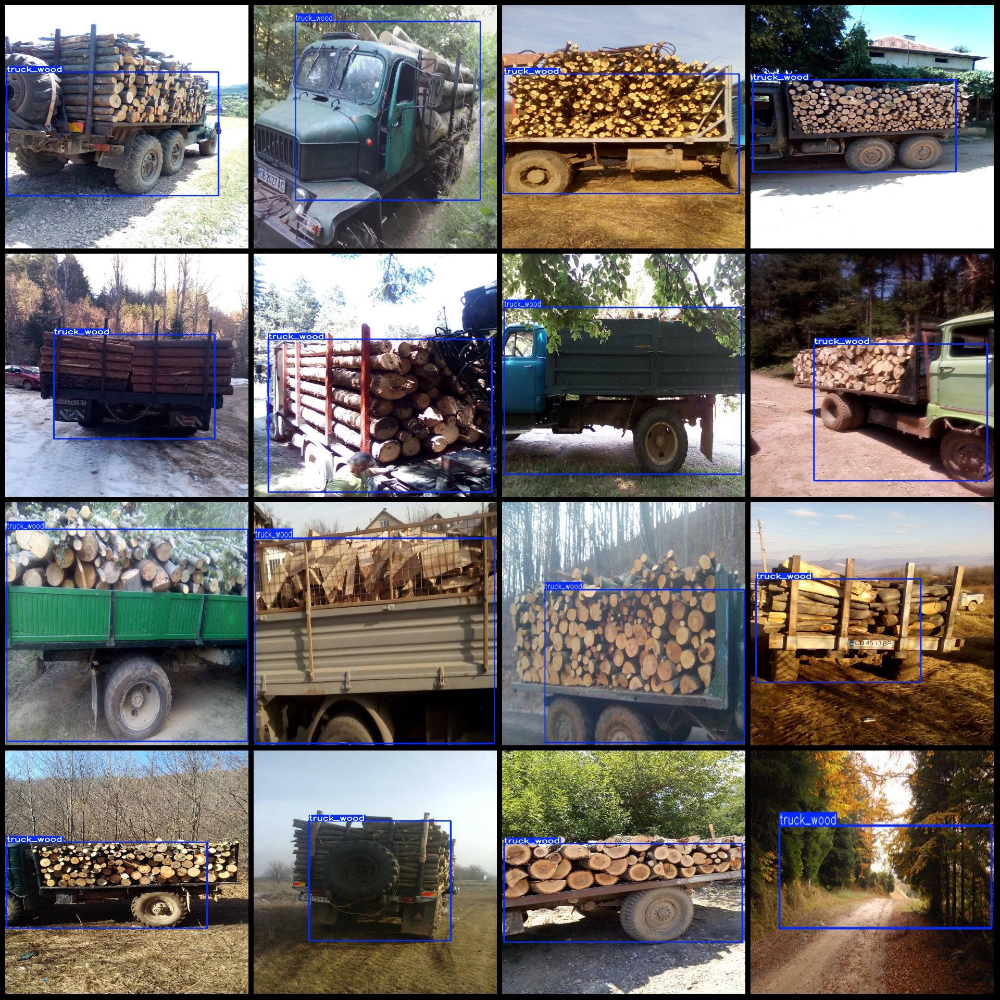
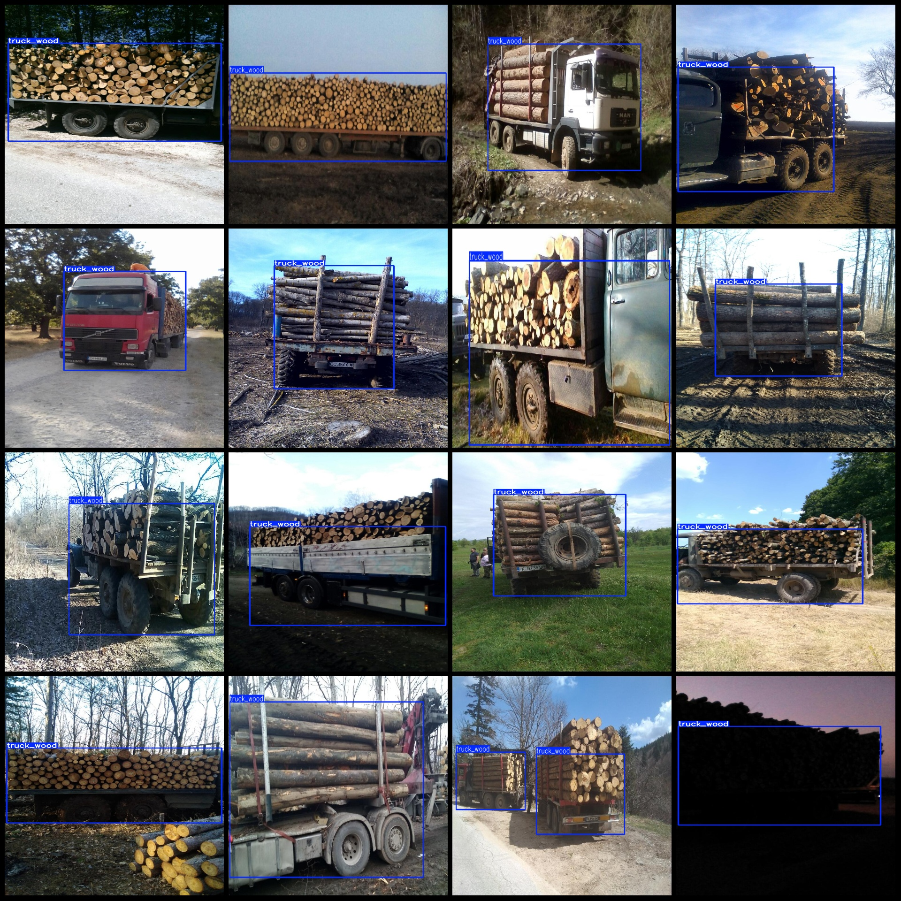

# Wood Transport Truck Detection Dataset VOC+YOLO Format with 1 category

Dataset format: Pascal VOC format + YOLO format (txt file without segmentation path, only containing jpg images and corresponding VOC format xml files and yolo format txt files)
Number of images (jpg file count): 1752
Number of annotations (xml file count): 1752
Number of annotations (txt file count): 1752
Number of annotation categories: 1
Annotation category names: ["truck_wood"]
Number of bounding boxes per category: 
Truck_Wood bounding boxes = 1817
Total bounding boxes: 1817
Number of images per category: 
Truck_Wood images = 1752
Image resolution: Multi-resolution images, such as 768x1024, 768x432 etc.
Labeling tool used: labelImg
Annotation rules: Draw a rectangular box for each category
Important note: The dataset does not need to be divided into training, validation, and test sets; the user must divide it themselves.
Special Statement: This dataset does not guarantee the accuracy of the trained model or weight file.
Image Preview:
Annotation Example:
## Images

Here is a pay link on Stripe ( https://buy.stripe.com/3cs8yP7sY87d0vu9AB ). Please contact me lonlonago@foxmail.com after funding $89, and I will send you a complete data files , thank you!

